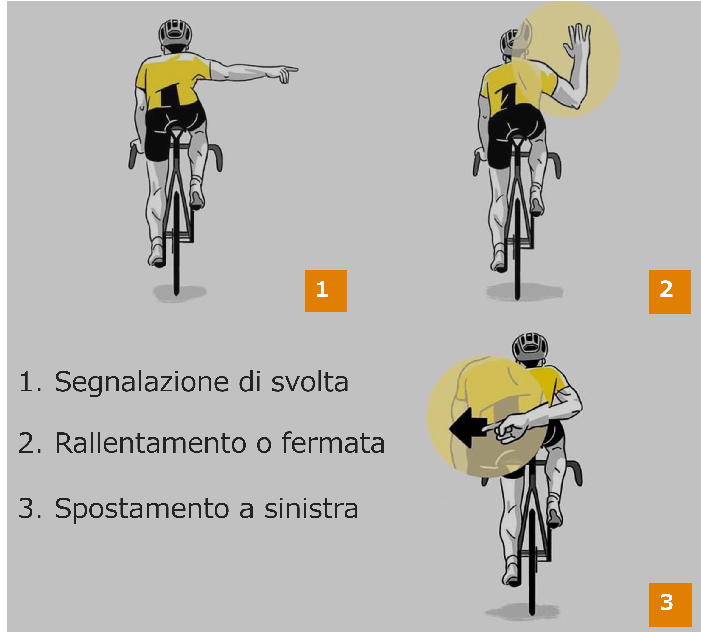

# Posizionamento elettrodi

# Descrizione Dati acquisiti
i dati di imu sono grezzi (non sono moltiplicati per sensitivity)
Un file contiene più ripetizioni dello stesso gesto
Ogni ripetizione è separabile dalle altre controllando la differenza tra timestamp consecutivi.
I campioni IMU se appartengono alla stessa ripetizione hanno diff_time = 192
I campioni ADC se appartengono alla stessa ripetizione hanno diff_time = [997 - 1020] circa

L'ultima riperizione dei file potrebbe essere una serie temporale non completa

## Gesture: 
- stopping
- turning
- left shift, danger

reference: https://channel.endu.net/ciclismo/il-codice-dei-ciclisti/

## Sensor:
- IMU LSM6DSOX (Acc, Gyro): frequency 208Hz
- ADC (4 channels): frequency 1kHz

range Acc: [-4, +4]g +/-0.122 mg
sensitivity: LSM6DSOX_ACC_SENSITIVITY_FS_4G   0.122f
Acceleration[0] = (int32_t)((float)((float)data_raw.i16bit[0] * sensitivity));

range Gyro: [-2000, +2000]dps +/-70mdps
sensitivity: LSM6DSOX_GYRO_SENSITIVITY_FS_2000DPS  70.000f
AngularRate[0] = (int32_t)((float)((float)data_raw.i16bit[0] * sensitivity));

range ADC: [0, 4095]

# Creazione Dataset
I dati adc e imu sono contenuti nella cartella 'data'
La cartella 'data' ha due sottocartelle, 'adc' e 'imu', che hanno a loro volta sottocartelle nominate come i gestures presi in analisi.

Per creare il dataset eseguire lo script 'MainCreateDataset.py'.

