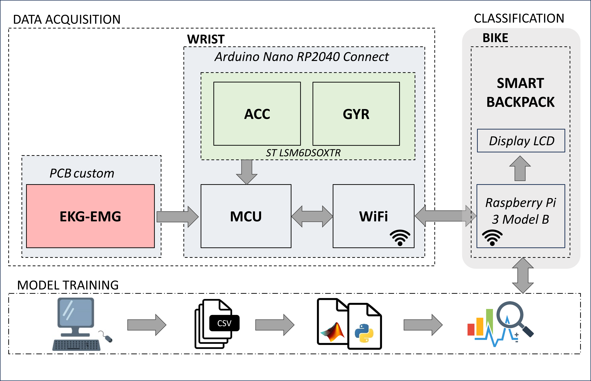

# EMGesture

## electrode position

## Gesture: 
- Left turn
- Stopping
- Right turn

reference: https://channel.endu.net/ciclismo/il-codice-dei-ciclisti/

## Experimental Setup

## Sensor:
- IMU ST Microelectronics LSM6DSOXTR (Acc, Gyro): 16 bit @ 208 Sa/s
- Raspberry Pi RP2040 - ADC: 4 channel, 12 bit @ 1kSa/s

range Acc: [-4, +4]g +/-0.122 mg
sensitivity: LSM6DSOX_ACC_SENSITIVITY_FS_4G   0.122f

range Gyro: [-2000, +2000]dps +/-70mdps
sensitivity: LSM6DSOX_GYRO_SENSITIVITY_FS_2000DPS  70.000f

range ADC: [0, 4095]
